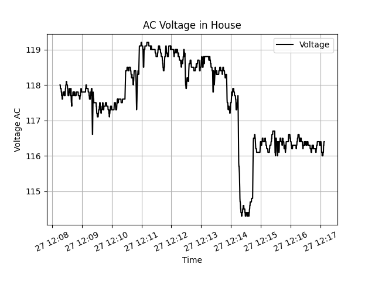

# Capture and Plot utilities for BTMETER BT-90EPC DMM (rebranded HP-90EPC)

The capture scripts are forked from https://github.com/adnidor/vc820py with the only change being the addition of a datetime.now() to the generated CSV

$35 DMM with USB serial capabilities:

https://www.amazon.com/gp/product/B07C238GTP

## Capture command to run on raspberry pi in background

nohup python3 read_from_serial.py --csv test.csv >/dev/null 2>&1

## Plotting tool

matplotlib is used to plot the generated CSV

### Example plot

## References

http://xuth.net/programming/tp4000zc/

https://sigrok.org/wiki/Multimeter_ICs#Fortune_Semiconductor_FS9721_LP3

https://pypi.org/project/pydmm/

https://github.com/tuxmaster/QtDMM
